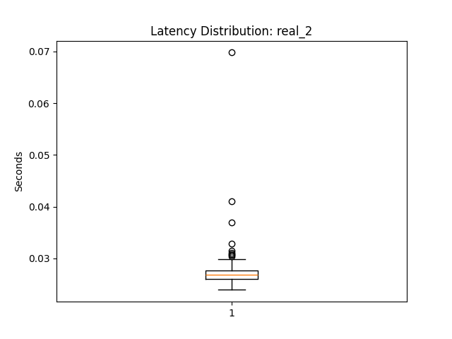
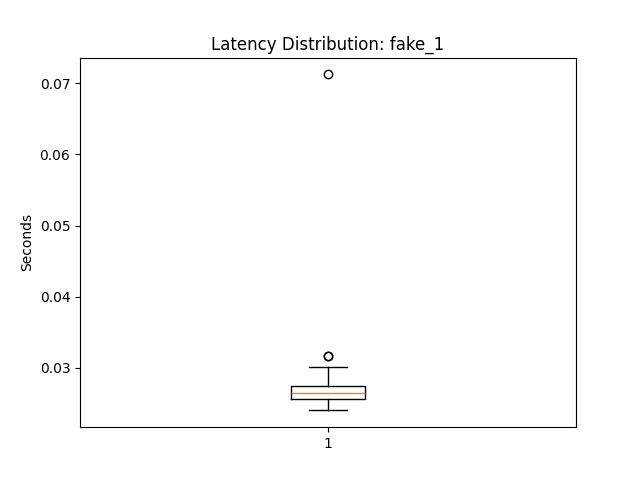
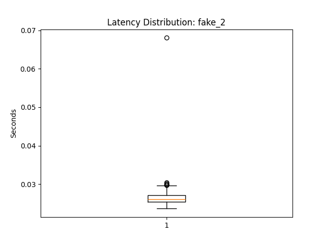

# E444-F2025-PRA5 # Latency Boxplots

Below are the boxplots visualizing API response time distributions for each test case:

Real 1: Input: It is 2025 this year

Average latency for real_1: 0.0271s

Real 2: Input: Canada is next to the United States

Average latency for real_2: 0.0277s

 

Fake 1: Input: The sky is falling

Average latency for fake_1: 0.0271s

Fake 2: Input: The world is made of cheese

Average latency for fake_2: 0.0268s

 

